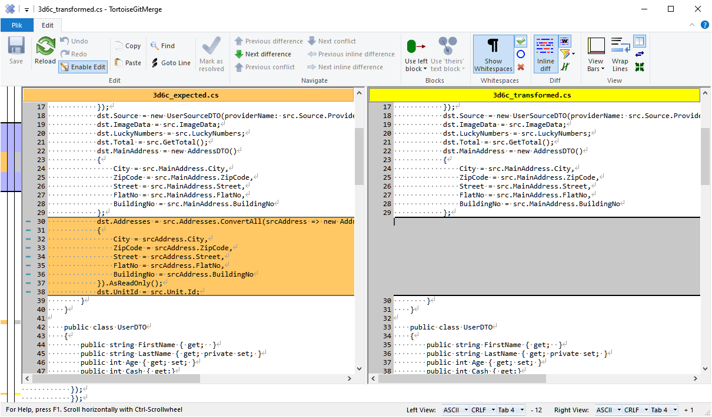

# RoslynTestKit

A lightweight framework for writing unit tests for Roslyn diagnostic analyzers, code fixes, refactorings and completion providers.
This is a port of [RoslynNUnitLight.NetStandard](https://github.com/phoenix172/RoslynNUnitLight.NetStandard). The main reasons to create a fork that is independent were:

- make the library independent of the test framework
- decrease response time for reported issues


### Quick Start

1. Install the [SmartAnalyzers.RoslynTestKit ](https://www.nuget.org/packages/SmartAnalyzers.RoslynTestKit/)
   package from NuGet into your project.
2. Create a new class that inherits from one of the provided ```*TestFixture```
   classes that matches what are going to test.

   * [```DiagnosticAnalyzer```](http://source.roslyn.io/#Microsoft.CodeAnalysis/DiagnosticAnalyzer/DiagnosticAnalyzer.cs) = ```AnalyzerTestFixture``` 
   * [```CodeFixProvider```](http://source.roslyn.io/#Microsoft.CodeAnalysis.Workspaces/CodeFixes/CodeFixProvider.cs) = ```CodeFixTestFixture```
   * [```CodeRefactoringProvider```](http://source.roslyn.io/#Microsoft.CodeAnalysis.Workspaces/CodeRefactorings/CodeRefactoringProvider.cs) = ```CodeRefactoringTestFixture``` 
   * [```CompletionProvider```](http://source.roslyn.io/#Microsoft.CodeAnalysis.Features/Completion/CompletionProvider.cs) = ```CompletionProviderFixture``` 

3. Override the ```LanguageName``` property and return the appropriate value
   from [```Microsoft.CodeAnalysis.LanguageNames```](http://source.roslyn.io/#Microsoft.CodeAnalysis/Symbols/LanguageNames.cs),
   depending on what language your tests will target.
4. Override the ```CreateAnalyzer``` or ```CreateProvider``` method and return
   an instance of your analyzer or provider.

5. Override the `References` property if you want to provide external dependencies for parsed code.

6. Write tests!

### Writing Unit Tests

RoslynTestKit accepts strings that are marked up with ```[|``` and ```|]``` to identify a particular span. This could represent the span of an expected
diagnostic or the text selection before a refactoring is applied. 
Instead of the markers you can also provide line number to locate the place of expected diagnostic.

### External dependencies

Every `*TestFixture` has a `References` property which allows providing external dependencies required by the test case code/markup. There is also a couple of helper methods in `ReferenceSource` class that allow to easily define these dependencies. A sample setup for analyzer test with external dependencies can looks as follows:

```csharp
public class SampleAnalyzerTest : AnalyzerTestFixture
{
    protected override string LanguageName => LanguageNames.CSharp;
    
    protected override DiagnosticAnalyzer CreateAnalyzer() => new SampleAnalyzer();
    
    protected override IReadOnlyCollection<MetadataReference> References => new[]
    {
        ReferenceSource.FromType<ReaderWriterLock>()        
    };
}
```

#### Example: Test presence of a diagnostic

```C#
[Test]
public void AutoPropDeclaredAndUsedInConstructor()
{
    const string code = @"
class C
{
	public bool MyProperty { get; [|private set;|] }
	public C(bool f)
	{
		MyProperty = f;
	}
}";

    HasDiagnostic(code, DiagnosticIds.UseGetterOnlyAutoProperty);
}
```

#### Example: Override test project and test document names

```C#
[Test]
public void AutoPropDeclaredAndUsedInConstructor()
{
    const string markup = @"
class C
{
	public bool MyProperty { get; [|private set;|] }
	public C(bool f)
	{
		MyProperty = f;
	}
}";
    var document = this.CreateDocumentFromMarkup(markup, "MySampleProject", "MySampleDocument");
    var diagnosticLocation = this.GetMarkerLocation(markup);
    HasDiagnostic(document, DiagnosticIds.UseGetterOnlyAutoProperty, diagnosticLocation);
}
```

#### Example: Test absence of a diagnostic

```C#
[Test]
public void AutoPropAlreadyReadonly()
{
    const string code = @"
class C
{
    public bool MyProperty { get; }
    public C(bool f)
    {
        MyProperty = f;
    }
}";

    NoDiagnostic(code, DiagnosticIds.UseGetterOnlyAutoProperty);
}
```

#### Example: Test code fix behavior

```C#
[Test]
public void TestSimpleProperty()
{
    const string markupCode = @"
class C
{
    public bool P1 { get; [|private set;|] }
}";

    const string expected = @"
class C
{
    public bool P1 { get; }
}";

    TestCodeFix(markupCode, expected, DiagnosticDescriptors.UseGetterOnlyAutoProperty);
}
```
Instead of the diagnostic descriptor, you can also use Diagnostic Id (error code) to identify the issue which should be fixed by tested code fix. This allows testing code fixes which respond to standard C# compiler errors such as `CS0736`.

#### Example: Test code refactoring behavior

```C#
[Test]
public void SimpleTest()
{
    const string markupCode = @"
class C
{
    void M()
    {
        var s = [|string.Format(""{0}"", 42)|];
    }
}";

    const string expected = @"
class C
{
    void M()
    {
        var s = $""{42}"";
    }
}";

    TestCodeRefactoring(markupCode, expected);
}
```

#### Example: Test completion provider based on expected suggestions

```csharp
[Test]
public void SimpleTest()
{
    const string markupCode = @"
class C
{
    void M()
    {
        var s = string.Format([||], 42);
    }
}";

    TestCompletion(markupCode, new []
    {
        "first expected suggestion",
        "second expected suggestion"
    });
}
```

#### Example: Test completion provider based on custom checks
```csharp
[Test]
public void SimpleTest()
{
    const string markupCode = @"
class C
{
    void M()
    {
        var s = string.Format([||], 42);
    }
}";

    TestCompletion(markupCode, (ImmutableArray<CompletionItem> suggestions) =>
    {
        //TODO: Custom assertions
    });
}
```

## Code comparision

In case of discrepancy between the expected code and the generated one, when testing CodeFixes and CodeRefactorings, the `TransformedCodeDifferentThanExpectedException` is thrown. However, when the test is run with the attached debugger a `diff tool` is launched to present the differences. RoslynTestKit is using under the hood the [ApprovalTests.Net](https://github.com/approvals/ApprovalTests.Net) so a wide range of diff tools on `Windows`, `Linux` and `Mac` are supported.



If the debugger is not attached, an inline text diff is presented in the console. An example diff can looks as follows:

```plaintext
RoslynTestKit.TransformedCodeDifferentThanExpectedException : Transformed code is different than expected:
===========================
From line 25:
- ················ZipCode·=·src.MainAddress.ZipCode,
===========================
From line 29:
- ············dst.Addresses·=·src.Addresses.ConvertAll(srcAddress·=>·new·AddressDTO()
- ············{
- ················City·=·srcAddress.City,
- ················ZipCode·=·srcAddress.ZipCode,
- ················Street·=·srcAddress.Street,
- ················FlatNo·=·srcAddress.FlatNo,
- ················BuildingNo·=·srcAddress.BuildingNo
- ············}).AsReadOnly();
- ············dst.UnitId·=·src.Unit.Id;
===========================
From line 71:
- ········public·string·ZipCode·{·get;·set;·}
+ ········public·string·ZipCode·{·get;·}
===========================
From line 94:
- ········public·List<AddressEntity>·Addresses·{·get;·set;·}
- ········public·UnitEntity·Unit·{·get;·set;·}
===========================
From line 124:
- ········public·string·BankName·{·get;·set;·}
+ ············public·string·BankName·{·get;·set;·}
```